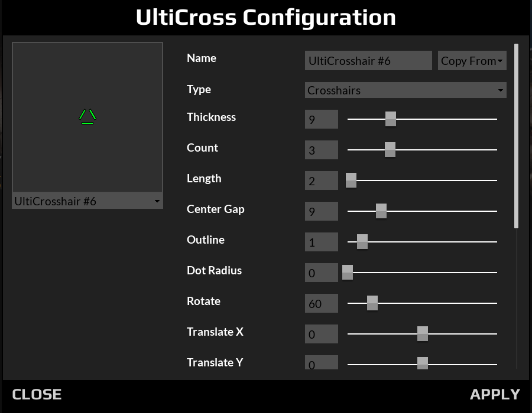

# UT4 UltiCross

Parameterized Crosshairs for UT4.

## Installation

Download the latest release from GitHub and extract the contents to your
Unreal Tournament 4 installation directory.

For example, if Unreal Tournament 4 is installed to
`C:\Games\UnrealTournament`, then the following files should be installed:

* `C:\Games\UnrealTournament\UnrealTournament\Content\Paks\UltiCross\UltiCross-WindowsNoEditor.pak`
* `C:\Games\UnrealTournament\UnrealTournament\Plugins\UltiCross\UltiCross.uplugin`
* `C:\Games\UnrealTournament\UnrealTournament\Plugins\UltiCross\Binaries\Win64\UE4-UltiCross-Win64-Shipping.dll`
* `C:\Games\UnrealTournament\UnrealTournament\Plugins\UltiCross\Binaries\Win64\UE4Editor-UltiCross.dll`

**IMPORTANT: If you installed an alpha version, remove the following files
first:**

* `C:\Games\UnrealTournament\UnrealTournament\Content\Paks\UltiCross\BP_UltiCrosshair_Slot01-WindowsNoEditor.pak`
* `C:\Games\UnrealTournament\UnrealTournament\Content\Paks\UltiCross\BP_UltiCrosshair_Slot02-WindowsNoEditor.pak`
* `C:\Games\UnrealTournament\UnrealTournament\Content\Paks\UltiCross\BP_UltiCrosshair_Slot03-WindowsNoEditor.pak`

## Usage

Run `ulticross` from the console to customize your crosshairs.

You must also go to your UT weapon settings and assign your weapons your
desired crosshair.

## Examples

Here are some examples of the crosshairs you can make with UtliCross:

